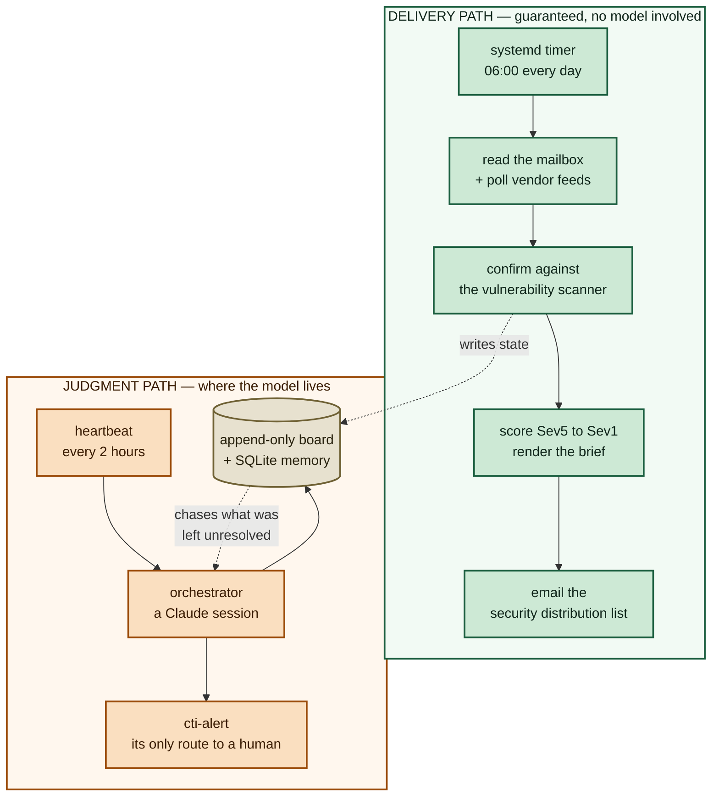
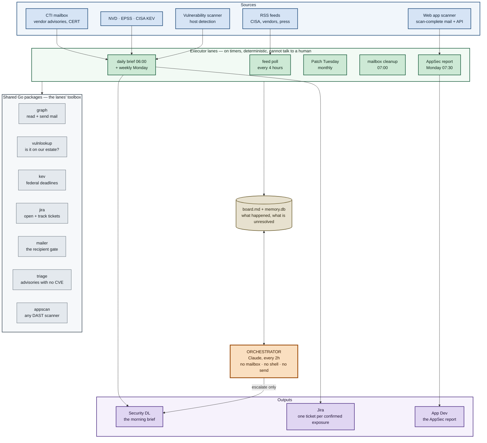

# How this works, and why it exists

Two pages. The first answers *why would I want this*; the second, *how does it
actually work*. For the full argument see
[AGENT-FLEET-PATTERN.md](AGENT-FLEET-PATTERN.md).

---

## The problem

Fifty vendor advisories, CERT bulletins and threat roundups arrive overnight.
Four of them concern software you actually run. Nobody has time to read fifty,
so in practice nobody reads any — and the four that mattered are found later, by
somebody else, under worse circumstances.

This is not a hard problem. It is a *tedious* problem with a daily rhythm, and
it is exactly the kind of work that gets dropped first when a two-person
security team has a bad week.

## What it does

Every morning at 06:00 an email arrives naming the vulnerabilities that are
**both** actively exploited in the wild **and** confirmed present on machines in
our estate, with the affected hostnames and a Jira ticket already open for IT.

Everything else is counted and not discussed.

Every Monday a second, separate email goes to the people who own our
**application code**: what the web application scanner found open on each of
our sites, which findings are new since the last scan, and whether each scan
logged in or covered only the public pages. Different audience, different
recipient list, enforced in code — the patching team and the application team
each get only the mail meant for them.

---

## The one design decision worth understanding

Most people assume an "AI agent" means the model runs the show. Here it is the
opposite, deliberately:

**The morning brief never passes through the model.** If the model is slow,
rate-limited, out of credit, or refuses for reasons nobody can reproduce, the
brief still lands at 06:00. That is the difference between a tool you can put in
a compliance narrative and a demo.

The model does the work that genuinely needs judgment and where being wrong is
recoverable: chasing a finding nobody resolved, noticing a Sev5 that has been
open eleven days, spotting that a timer got disabled. It advises. It does not
deliver.

> **The general principle:** put the model where being wrong is recoverable, and
> keep it out of the path where being absent is unacceptable. A system that
> routes its guaranteed deliverable through a probabilistic component has a
> probabilistic deliverable.

## Why you can trust the output

| Property | How it is achieved |
|---|---|
| **The brief arrives even when the model does not** | No model in the delivery path at all |
| **"We have this" is a scanner fact, not a guess** | Every reported CVE is confirmed present by host detection before it is scored |
| **Silence means a quiet day, not a dead pipeline** | A failed lane escalates by email; a growing unread backlog escalates on its own |
| **It cannot mail the wrong people** | Recipients are a hard allowlist enforced in code, one per report; there is no default recipient, and a report never falls back to another report's list |
| **A wrong answer can be traced** | Every claim names its source; every ticket carries the full host list |

## What it will never do

It does not patch anything, change a firewall, or touch production. Remediation
is IT's job — the fleet opens the ticket and then reports that ticket's status
in the brief until it closes.

It does not decide what a human may see. The analysis step annotates; it is
structurally unable to drop an item.

---

## How it is built

Five boring parts. That is the point — each can be understood, tested and
repaired by someone who has never read the others.

### The five primitives

| Primitive | Here | Why it exists |
|---|---|---|
| **Orchestrator** | A Claude session every 2 hours | Judgment. Decides what to chase and what to say nothing about |
| **Executor lanes** | Six systemd timers, plus the heartbeat's | Deterministic work. Each does one thing and cannot reach a human |
| **Heartbeat** | `cti-agent-checkin.timer` | Turns a program into a presence. It wakes whether or not you asked |
| **Message board** | Append-only markdown | How parts that never run at the same time talk to each other |
| **Persistent memory** | SQLite | Continuity. Without it every beat is a stranger starting over |

### What each lane adds

Each answers a different question, and the brief is the join across them.

- **What is being talked about?** — the mailbox and the feeds
- **Do we actually have it?** — the scanner, which turns an advisory into an
  inventory fact
- **Is the world attacking it?** — CISA KEV and exploit-prediction scoring
- **What didn't arrive in the mailbox?** — the feed poller, so coverage does not
  depend on who remembered to subscribe us
- **Has someone external set a deadline?** — federal remediation due dates
- **What does a human do with this?** — a Jira ticket, with the hostnames
  attached, because our team reports and IT remediates
- **Are our own applications exposed?** — the web application scanner, read
  from its own completion mail and API, and reported to the people who write
  the code. Every count says whether that scan logged in, because a zero from a
  scan that only saw the public pages is a different number. The scanner is
  behind a provider boundary, so a second one is a parser, not a rewrite
- **Is the fleet itself healthy and affordable?** — the heartbeat, rationed
  against the model subscription so a crash loop cannot exhaust it

### The constraints on the model

The orchestrator has no mailbox, no shell and no ability to address mail. It
may call a short allowlist of commands — named **per subcommand**, so it can
write its own notes but cannot record a digest as sent, rewrite a finding, or
mark a monthly release delivered — and nothing else. It cannot run any lane:
every one of them sends or moves mail, and timers own them. Its only route to a
person is `cti-alert`, which has no recipient argument. A test checks that
everything its instructions tell it to run is on that list, and that nothing
they forbid is.

Separately, the component that reads advisory text — which arrives at a
published address anyone can write to, and is therefore hostile input — runs
with **no tools at all**. It is handed one file and writes one file, and
everything it reports is checked back against the source text before it reaches
anyone.

---

## Where to go next

| You want to | Read |
|---|---|
| The full design argument | [AGENT-FLEET-PATTERN.md](AGENT-FLEET-PATTERN.md) |
| Run it, or fix it at 06:30 | [RUNBOOK.md](RUNBOOK.md) |
| The threat model and accepted risks | [SECURITY.md](SECURITY.md) |
| What changed, and what upgrading requires of you | [CHANGELOG.md](CHANGELOG.md) |
